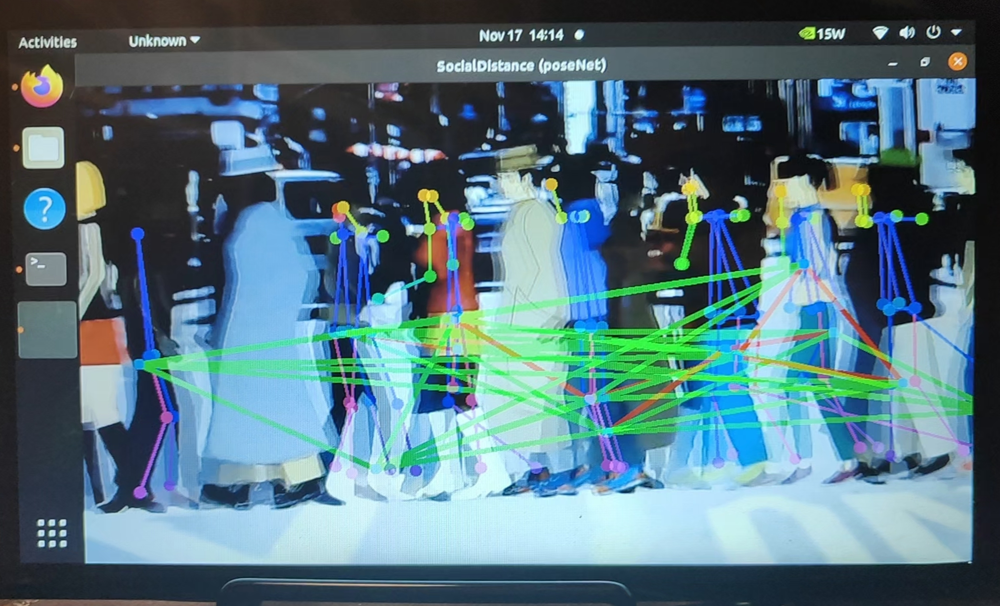
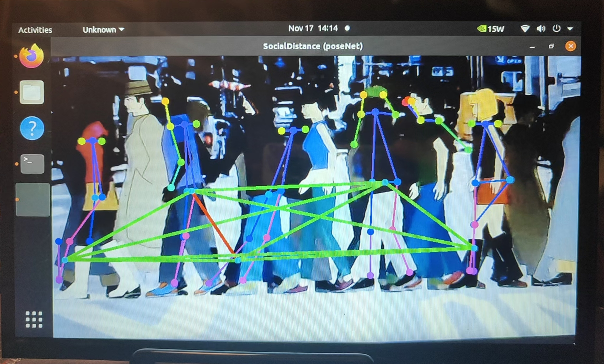

# 👣 Social Distance Monitor on Jetson Nano via poseNet
**Course:** DATA 690 – Special Topics in AI  
**Student:** Soumya Bhate  
**Instructor:** Prof. Levan Sulimanov

Simple real‑time **social‑distance-monitor** running inside Dusty’s `jetson-inference` Docker container on NVIDIA Jetson.

The script:

- 🎥 Takes live video from your Jetson camera (e.g. `/dev/video0`)
- 🧍‍♂️🧍‍♀️ Detects people using `poseNet` (`resnet18-body`)
- 📏 Calculates **Euclidean distance** between each pair of people
- 🔴🟢 Draws **red lines** when people are too close and **green lines** when they are okay
- 🧾 Writes a log file `room.log` with how many people and how many violations were seen

I kept everything **simple and transparent** so you know exactly what is happening.

---

## 🧩 What we use in the code?

- **poseNet from `jetson-inference`** 
  GitHub: `dusty-nv/jetson-inference` (it already contains poseNet, detectNet, etc.)

- **Euclidean distance**  
  For two centers `(x1, y1)` and `(x2, y2)` we compute:

  ```python
  dx = x1 - x2
  dy = y1 - y2
  d = (dx**2 + dy**2) ** 0.5
  ```

  If `d` is smaller than a threshold (`THRESHOLD_PX`), we treat it as a **violation** and color the line **red**.

- **Hip + Shoulder keypoints for center of person**
  - First we try **hips** (keypoints 11 and 12).  
  - If hips are missing, we fall back to **shoulders** (keypoints 5 and 6).  
  - The average of left + right point gives us a **center** for that person.

  This fixes the issue where the log was always `people=0, viol=0` even in a crowd, because sometimes the hips were not detected or were outside the frame.

- **Log file `room.log`**  
  For every loop we log a line like:

  ```text
  2025-11-17 12:34:56,poses=5,people=3,viol=2
  ```

  - `poses`  = how many people poseNet saw  
  - `people` = how many centers we successfully calculated (hip or shoulder)  
  - `viol`   = how many pairs were too close  

  The log is created automatically in the same folder as `social_distance.py`.

---

## 📁 Step 1 – Create and mount a `Development` folder

We **do not** code directly inside the `jetson-inference` repo.  
Instead we use a clean separate folder called `Development`.

On the **host Jetson (outside Docker)**:

```bash
mkdir -p ~/Development
```

We then mount this folder into the Docker container by editing `run.sh` (the script that launches Dusty’s `jetson-inference` container).

1. The `sudo docker run ...` line of `run.sh`, should be:
```bash
sudo docker run --runtime nvidia -it --name dev_container \
```
2. In the same `sudo docker run ...` block where all -v commands are pasted add path:
```bash
-v /home/ms77930/Development:/app/dev \
```

> 🔁 You can change `dev_container` to any container name you like.

### 🤔 Why this `Development` mount?

- We had **accessibility issues** working directly inside the `jetson-inference` paths from the container.  
- Mounting `~/Development` as `/app/dev` gives us:
  - A **simple project space** we control from host + container
  - All our code is visible on the host for editing (VS Code, etc.)
  - The container can still use **all of jetson-inference’s libraries** without us copying this project inside that repo.
- Whatever we save in `~/Development` on the host is instantly available at `/app/dev` inside the container.

---

## 📂 Step 2 – Create the project folder and files

On the **host** (your normal user, e.g. mine was `ms77930@Soumya:~$`):

```bash
cd ~/Development
mkdir social_distance_monitor
cd social_distance_monitor
```

Inside this folder you place:

- `social_distance.py`  ← our main script  
- (optional) `posenet.py` or any helper file you want

You can copy the file from USB, use an editor like `nano`, or paste the code from your editor.

Example (quick way with nano):

```bash
nano social_distance.py
# paste the code, save and exit
```

---

## 🐳 Step 3 – Start the Docker container

Every time you want to run the project:

1. **Allow local X11 access** (so Docker GUI can open windows):

   ```bash
   xhost +local:
   ```

2. **Start the container** (if it is not already running):

   ```bash
   docker start dev_container
   ```

3. **Enter the container shell**:

   ```bash
   docker exec -it dev_container /bin/bash
   ```

You should now see something like:

```text
root@<some-jetson-container>:/#
```

This means you are **inside** the Docker container.

---

## 🚀 Step 4 – Run the Social Distance Monitor

Inside the **container shell**:

1. Go to the mounted folder:

   ```bash
   cd /app/dev/social_distance_monitor
   ```

2. (First time only) make the script executable:

   ```bash
   chmod +x social_distance.py
   ```

3. Find which video device you want to use:

   ```bash
   ls /dev/video*
   ```

   Usually it is `/dev/video0`, but if you have more cameras you might see `/dev/video1`, etc.

4. Run the script (example with `/dev/video0`):

   ```bash
   ./social_distance.py /dev/video0
   ```

   - A window should open with the camera feed.
   - Lines between people will be **green** (safe) or **red** (too close).
   - The file `room.log` will be created/updated in this same directory.

> 💡 Because the folder is mounted, `room.log` and any output you create will also appear on the host in `~/Development/social_distance_monitor`.

---

## 📸 Example Output
It might look something like this depending upon the crowd that is being recorded.
<p align="center">
  
  
</p>

---

## 👀 Why hips alone were not enough (and why we added shoulders)

At first we only used the **hip keypoints** (11 + 12) for each person.  
In theory this is good because hips are near the center of mass.

But in our real test videos:

- The camera often showed only the **upper body**  
- People were partially **cropped** in the frame  
- poseNet sometimes missed the hip keypoints completely

So even with a crowd in front of the camera, our script saw:

```text
people=0, viol=0
```

because there were **no valid centers** to calculate.

### ✅ Our fix: hip → shoulder fallback

We kept the original logic but added a fallback:

```python
L = kpt_xy(p, 11)   # left_hip
R = kpt_xy(p, 12)   # right_hip

if not (L and R):
    L = kpt_xy(p, 5)   # left_shoulder
    R = kpt_xy(p, 6)   # right_shoulder
```

- If hips exist → we use them  
- If hips are missing → we automatically switch to shoulders  

Shoulders are easier for poseNet to detect because they are:

- higher in the frame  
- almost always visible in normal camera angles  

Now the log file correctly shows people counts and violations.

---

## 🧠 Summary of what the script does

1. Reads one camera frame at a time (from `/dev/videoX`)
2. Runs poseNet (`resnet18-body`) to detect people
3. For each person:
   - Try hips (11 & 12)
   - If hips missing, use shoulders (5 & 6)
   - Compute center point
4. For each pair of people:
   - Compute **Euclidean distance**
   - Compare with `THRESHOLD_PX`
   - Draw red/green line
   - Count violations
5. Draw small circles on each center
6. Append a line to `room.log` with `poses`, `people`, `viol`

---

## 📝 Log file details

- File name: `room.log`
- Location: same folder as `social_distance.py` (`/app/dev/social_distance_monitor`)
- Created automatically on first run
- One line per update, for example:

  ```text
  2025-11-17 12:34:56,poses=5,people=3,viol=2
  ```

You can later use this file for:

- Plotting how crowded the area was over time  
- Checking how often people were too close  
- Simple analytics and experiments

---

## 🙏 Acknowledgements
- Developed as part of the mini project for the course **DATA 690 – Special Topics in AI (UMBC)**.
- Under the guidance of **Prof. Levan Sulimanov**.  
- Built on **NVIDIA Jetson Nano**, **JetPack 5.x**, and the **Jetson-Inference** framework from **Dusty's**.

Feel free to change the folder names, container name, or threshold values to match your own setup. The idea is to keep it **simple, clear, and easy to modify**. ✨
